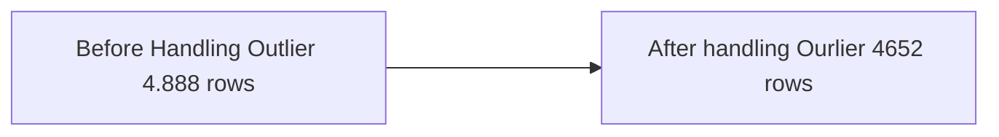

# travel_package_prediction
Supervised learning using XGBoost algorithm

# Problem Statement & Objective

The company "Trips&Travel.Com" wants to enable and build a successful business strategy in order to grow its customer base. They want to grow their consumer base by offering new package options. Based on last year's statistics, they discovered that only 18% of customers purchased packages. However, marketing costs are quite high because customers are contacted at random without choosing which of the right customers to offer the product to based on the available information. The Health Tourism Package is a new product that the company is planning to launch. They want to make marketing spending more efficient by predicting consumer records by analyzing available customer data and information. 

# Problem Questions

Is it possible to predict which consumers will be offered a new travel package using a machine learning model algorithm? It is hoped that by using the machine learning model algorithm, it would be possible to discover the ideal customers for travel packages while also calculating CAC and revenue.

# Data and Assumption

Trips&Travel.com has 4888 customers, according to previous year's data. Unfortunately, just 18% of all clients that purchase travel packages. To predict, I'll analyze and implement a machine learning algorithm which customers are interested to buy the new travel packages. In terms of business metrics, I want to increase customer retention, estimate CAC, and increase revenue.

Source: https://www.kaggle.com/datasets/susant4learning/holiday-package-purchase-prediction

# Analysis
**Exploratory Data Analysis & Data Preprocessing**

 - There are `4,888 rows` in all, including the following information: The data has `6 categorical` and `14 numerical` features, and the taken product  `(ProdTaken)` is a targeted feature.
 - Missing values are removed at a ratio `<1%`, `2 features` are imputed using the `mean` method, `1 feature` is imputed using the `median` method, and `3 features` are imputed using the `mode` method.
 - Data transformations: Converts `fe male` to `female` and merges `unmarried` and `single` into a `single` category. because these concepts have the same definition and meaning.
 - `CustomerID` should be removed because it has no effect and is not utilized.
 - There are `140 duplicate items`, the next one is removed.
 - `Passport Age`, `Monthly Income`, `Number of Followups`, `Preferred Property Star`, `Number of Person Visiting` , `City Tier`, `Duration of Pitch` has a strong correlation to the main features.
 - Handling outliers with the IQR method: `DurationOfPitch`, `NumberOfTrips`, `MonthlyIncome`, `NumberOfFollowups`, `NumberOfPersonVisiting`. they have outlier values ​​far from Q1 and Q3:

Before-> 

After-> 

 - Using the Label encoding method for the `ProductPitched` and `Designation` features.
 -Using the One hot encoding method for the `TypeofContact`, `Occupation`, `MaritalStatus'`, `Gender`.
 - Split Feature and Label `ProdTaken`as a primary feature.
 - Splitting the data into Train and Test using **sklearn** with ratio 30/70. Because, after splitting the data into imbalances, the SMOTE method is used to deal with the imbalance data.

**Model & Evaluation**

`Logistic Regression, Decision Tree, Random Forest, kNN, AdaBoost, and XGBoost` are the six modeling algorithms I've tested. I choose `XGBoost` among the six algorithm models because it has the best stability and performance. In this case, I'd want to focus on modeling `Recall` in order to eliminate false negatives that effect actual customers who want to buy a package holiday but are detected as not looking to buy. 182 of the 253 customers who purchased travel packages accurately predicted their goals. It can be assumed that the modeling success rate is 72%. 

**Business Insight**

Before using the model, the percentage of the number of holiday package buyers was only 18% but after using the model the results increased to 72% (*expected performance). I use the CAC method with the following statement to see how the model impacts revenue. 

                  Before Using Model Prediction

|     Marketing Tool           |Cost                         |Quantity             | Amount Spent                         |
|----------------|-------------------------------|-----------------------------|--------------|
|Call Campaigns     |    $1          |4.888                   |$4.888            |
|         |                  |**Total Marketing Expenses**           | $4.888
|          |                 |**New Customers Acquired**| 920
|          |                 |**CAC**                          | **$5.31**

Only **920** people purchased travel packages out of a total of 4,888 customers that purchased an offer (18%). Assumed Per-Person Cost **$1**. As a result, the Customer Accuititon Product costs **$5.31**.

                  After Using Model Prediction

|     Marketing Tool           |Cost                         |Quantity             | Amount Spent                         |
|----------------   |-------------------------------|-----------------------------|--------------|
|Call Campaigns        |    $1          |4.888                   |$4.888            |
|         |                  |**Total Marketing Expenses**           | $4.888
|          |                 |**New Customers Acquired**| **3.519**
|          |                 |**CAC**                          | **$1.38**

Assuming the algorithm can successfully anticipate up to 72% of cases, 3519 people will purchase a package holiday. The Customer acquisition costs is **$1.38**.  The CAC is decreasing, which has a positive effect on the company's revenue.

                      Revenue Simulation

|    Scenario          |Quantity                          |CAC             | Marketing Cost                         |
|----------------   |-------------------------------|-----------------------------|--------------|
|Before        |   920          |$5.31                   |**$4.876**           |
|After   |        3.519          |$1.38        | **$4.856**

Assume that the wellness package costs $500.

    Before ->  $500/package x 920 - $4.876 = $455.124(Revenue)
    After ->   $500/package x 3.519 - $4.856 = $1.754.644(Revenue)
  
It will cover marketing costs and **optimize** marketing campaigns with the same expenses but significantly ****increased** income** owing to the big number of customers who buy packages.

# Conclusion

Customer acquisition cost, known in marketing circles as CAC, describes how much a company has to spend to get a new customer. Developed a model that predicts the number of customers who will purchase the Wellness Tourism Package The efficiency of using the model is now at 73 %, up from 18 percent previously. The rise in the percentage of customers indicates that this analysis was successful in solving the company's problems. After analyzing the total money collected, it increased to $1,754,644, up from $455,124 before. This also cut marketing costs but also increased revenue.

for conclusions based on customer analysis who have the               potential to purchase bundles:
 - single
 - Living in a big city (tier 1) or moderate (tier 2),
 - Have a position Executive or Manager.
 - Previous consumers have purchased basic and standard products.
 - Have a passport

# Suggestions and Recommendations

The company has lost money due to a lot of ineffective marketing campaigns. "Trips&Travel.Com" wants to enable and establish a successful business model to increase their client base, but they are at a loss since they are not making the best use of their customer data base. Using a machine learning model, rips&Travel.Com's marketing campaigns are able to optimize income while lowering marketing expenditures. Of course the results of this analysis are not final and there is still much that can be improved because there are many different ways, methods and approaches. 
For Recommendation:
 - add variations to customer database features such as time, season, or package price.
 - include the marketing cost
 - increase marketing variation

**Action point**
 - Customers with passports can purchase travel packages for domestic and international locations.
 - Offering low-cost Wellness packages, such as Basic and Standard, to customers who have never purchased a vacation package before, as well as executives and managers.
 - Increasing promotions for customers from big and medium cities.
 - Offers single customers a suggested holiday package deal outside of long holidays.
